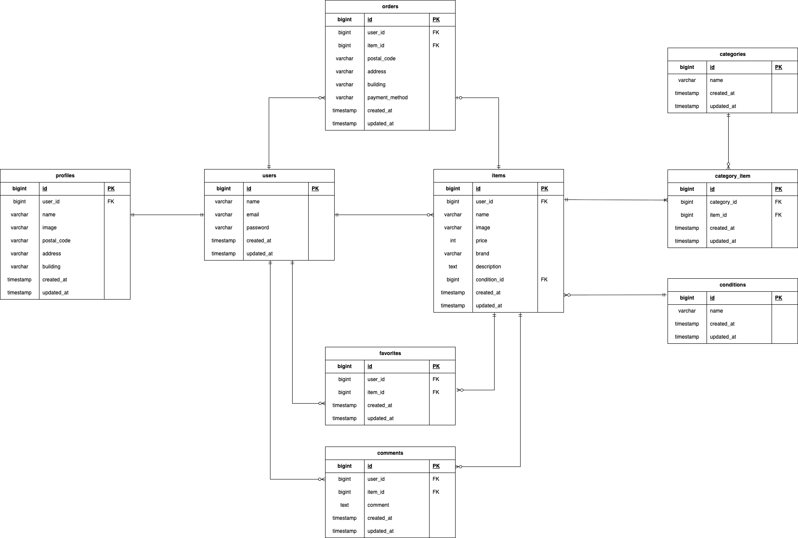

# アプリケーション名

Coachtechフリマ

## アプリケーション概要

```
フリマアプリ
- ユーザは会員登録後、アプリ内で商品の出品や商品購入ができる。
```

## 環境構築

### 1. リポジトリをクローン

git clone https://github.com/Tamori169/Laravel-furima.git  
cd Laravel-furima

### 2. Dockerコンテナを作成・起動

docker-compose up -d --build

### 3. PHPコンテナに入る

docker-compose exec php bash

### 4. Composerパッケージをインストール

composer install

### 5. .envファイルを作成

cp .env.example .env

### 6. アプリケーションキーを作成

php artisan key:generate

### 7. データベースマイグレーション

php artisan migrate

### 8. シーディング実行

php artisan db:seed

### 9. ストレージのシンボリックリンクを作成（画像アップロード用）

php artisan storage:link

### "The stream or file could not be opened"エラーが発生した場合

srcディレクトリにあるstorageディレクトリに権限を設定
chmod -R 777 storage

## 使用技術(実行環境)

```
- PHP 8.1.34
- Laravel 8.83.8
- MySQL 8.0.26
- Docker / Docker Compose
- phpMyAdmin
- Git / GitHub
```

## ER図

  

## URL

```
- 作成中
```

